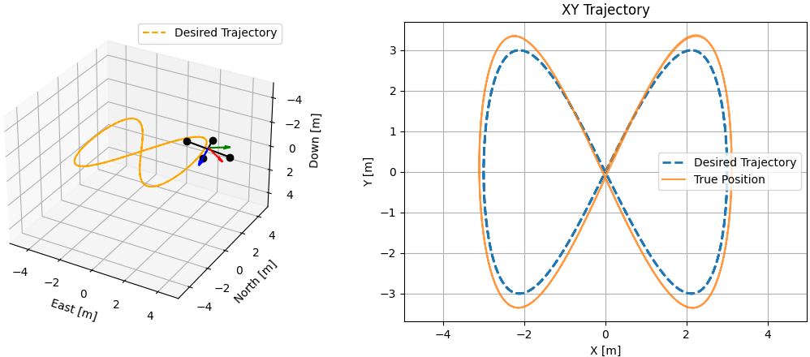

# RotorBench

A compact quadrotor flight simulator written in Python, designed for benchmarking, fast prototyping, and academic research.

## Features

1. **Lightweight quadrotor simulator**  
   Models quadrotor dynamics down to the force and torque level. Ideal for fast prototyping and algorithm testing.

2. **SE(3) rigid-body dynamics**  
   Accurate rigid-body updates using RK4 and the Cayley transform on SO(3).

3. **Multiple controllers included**  
   Geometric tracking, LQR, H∞, and RL controllers are available out of the box.

4. **Trajectory planning and visualization**  
   Planned reference trajectories and animated 3D visualization of quadrotor motion.

## Installation

```shell
pip install -r requirements.txt
```

## Usage

### Geometric Tracking Controller

```bash
python main.py --ctrl=GEOMETRIC_CTRL
```

### Linear Quadratic Regulator (LQR)

```bash
python main.py --ctrl=LQR
```

### H∞ Controller

```bash
python main.py --ctrl=HINFTY_CTRL
```

### Reinforcement Learning (Experimental)

Download a pre-trained policy:
```
mkdir -p runs/ppo_quadrotor/best
cd runs/ppo_quadrotor/best
wget https://github.com/shengwen-tw/quadrotor-sim-py/raw/refs/heads/blob/runs/ppo_quadrotor/best/best_model.zip
```

Start simulation with the RL controller:
```
python main.py --ctrl=RL
```

To train an RL policy:
```
python train_rl.py --traj HOVERING --iterations 1000 --n-envs 64 --total-steps 1000000000000
tensorboard --logdir runs/ppo_quadrotor
```

## Project Structure

```
rotor-bench/
├── main.py                 # Entry point of the simulation
├── train_rl.py             # RL training script
├── trajectory_planner.py   # Trajectory planner
├── models/                 # Dynamics and SE(3) math
│   ├── dynamics.py
│   ├── quadrotor.py
│   └── se3_math.py
├── control/                # Controllers (geometric, LQR, H∞, RL)
├── configs/                # Vehicle and trajectory configs
├── viz/                    # 3D visualization
├── assets/                 # Images and media
└── requirements.txt
```

## Preview



## License

This project is licensed under the **MIT License**.  
Feel free to use, modify, and distribute without restriction.
